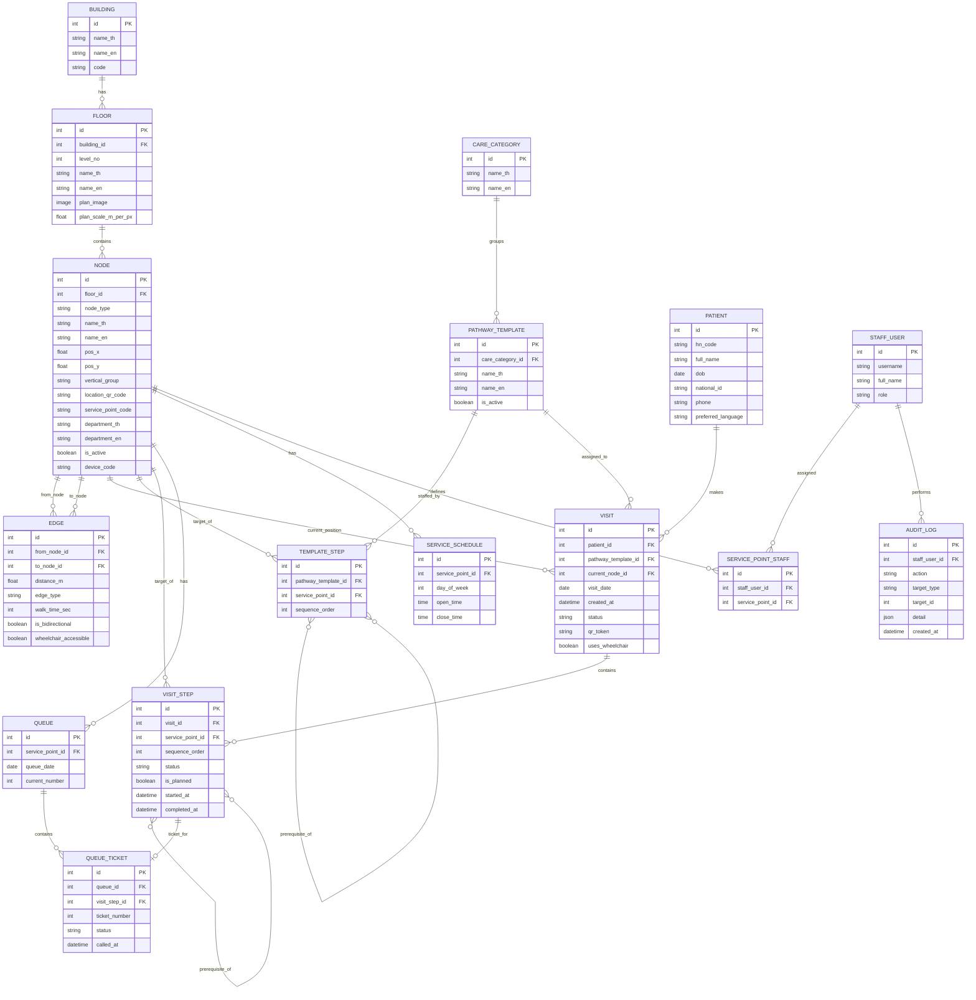

# ER Diagram — ระบบนำทางผู้ป่วยในโรงพยาบาล

Source of truth คือ [`MODELS.md`](MODELS.md) ไฟล์นี้เป็นภาพ mermaid `erDiagram` ที่ generate ตามนั้น
(field/relationship ต้องตรงกับ `MODELS.md` เสมอ — แก้ที่นั่นก่อนแล้วค่อย sync มาไฟล์นี้) เปิดดูแบบ render
ได้ทั้งบน GitHub/GitLab (รองรับ mermaid ในตัว) หรือรูปสำเร็จรูปที่ [`ER-Diagram.png`](ER-Diagram.png)

**หมายเหตุการอ่านความสัมพันธ์:**
- `TEMPLATE_STEP }o--o{ TEMPLATE_STEP : prerequisite_of` และ `VISIT_STEP }o--o{ VISIT_STEP : prerequisite_of`
  คือ self many-to-many (`prerequisite_steps` ใน `MODELS.md`) รองรับทั้ง fan-out (หลายสเต็ปรอ prerequisite ตัวเดียวกัน)
  และ fan-in (สเต็ปเดียวรอหลาย prerequisite พร้อมกัน)
- `ServicePoint`/`Kiosk` ไม่มีตารางแยก — ถูกยุบเป็น field ใน `NODE` แล้วแยกด้วย `node_type` (ดูรายละเอียดใน `MODELS.md`)
